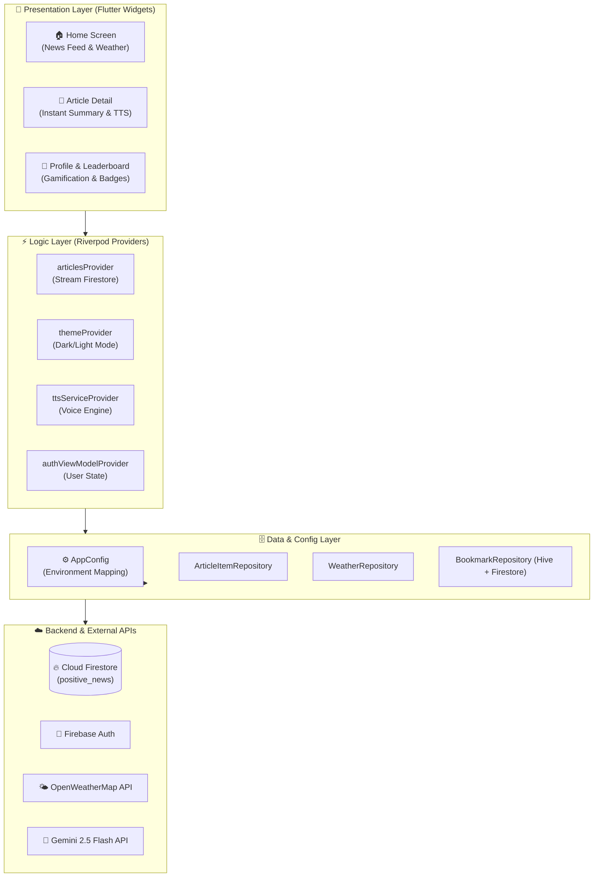

<p align="center">
  
</p>

# <p align="center">SafeNews Mobile App</p>

<p align="center">
  <b>A smart, constructive, and positive news reading platform built with Flutter, Riverpod, and Firebase.</b><br>
  <i>Features Instant 0s AI Summaries, Vietnamese Text-to-Speech (TTS), and Gamification.</i>
</p>

<p align="center">
  <a href="https://flutter.dev"></a>
  <a href="https://dart.dev"></a>
  <a href="https://riverpod.dev"></a>
  <a href="https://m3.material.io"></a>
  <a href="https://firebase.google.com"></a>
  <a href="https://deepmind.google/technologies/gemini/"></a>
  
  <a href="LICENSE"></a>
</p>

---

## 📑 Table of Contents
- [Overview](#-overview)
- [Key Features](#-key-features)
- [App Architecture](#-app-architecture)
- [Project Directory Structure](#-project-directory-structure)
- [Configuration & Environment Variables](#-configuration--environment-variables)
- [Quick Start Guide](#-quick-start-guide)
- [Gamification & Achievement System](#-gamification--achievement-system)
- [State Management: Riverpod](#-state-management-riverpod)
- [Roadmap](#-roadmap)
- [License](#-license)

---

## 🌐 Overview

**SafeNews** is a cross-platform mobile application developed with Flutter that shields readers from negative, sensationalist, and toxic news. By streaming AI-curated positive and safe articles directly from Cloud Firestore, SafeNews delivers a refreshing reading experience enhanced by instantaneous AI summaries, high-quality Vietnamese voice narration, and reading gamification.

---

## 🌟 Key Features

* 🌿 **Sentiment Badges**: Visual indicators distinguish `🌿 Positive News` from `🛡️ Safe Public Alerts` at a glance.
* ⚡ **Instant AI Summary (0s Delay)**: Pre-computed concise summaries delivered instantly from Firestore without waiting for client-side LLM inference.
* 🔊 **Instant Text-to-Speech (TTS)**: Built-in Vietnamese voice reading engine with intuitive playback controls directly from feed cards or the article reader screen.
* 🏆 **Gamification & Badges**: Tracks reading streaks, daily reading goals, and unlocks custom achievement badges (`Bookworm`, `Explorer`, `Week Streak`).
* 📱 **Adaptive UI/UX (Material Design 3)**:
  * Dynamic Safe Area header adapts seamlessly to phone notches and Dynamic Island.
  * Real-time Light & Dark theme toggle with Riverpod state synchronization.
  * Search bar with instant one-tap text clearing (`X`).
* 🔖 **Cloud & Offline Bookmarks**: Bookmark favorite articles with instant local cache and cloud synchronization.
* 🌤️ **Live Weather Widget**: Real-time geolocation weather forecast integrated into the home feed header.
* ⚙️ **Centralized AppConfig**: Strong typing and zero direct `.env` leaks across UI and repository components.

---

## 🏗️ App Architecture

SafeNews follows a clean, layered architecture separating Presentation, Logic, and Data layers:



---

## 📁 Project Directory Structure

```
assignment_3_safe_news/
├── assets/
│   ├── achievements/              # 🏅 SVG Achievement Badges
│   ├── default_images/            # 🖼️ News Fallback Image
│   └── icon/
│       └── ic_launcher.png        # 🏷️ High-Resolution App Brand Logo (512x512)
├── lib/
│   ├── environment/
│   │   └── environment.dart       # ⚙️ Centralized AppConfig
│   ├── constants/                 # 🎨 Theme, Colors & Category Constants
│   ├── features/
│   │   ├── authentication/        # 🔐 Firebase Auth & Google Sign-In
│   │   ├── home/                  # 📰 News Feed, Article Model & Weather
│   │   ├── bookmark/              # 🔖 Bookmark Management
│   │   └── profile/               # 👤 User Profile & Gamification Stats
│   ├── providers/                 # ⚡ Riverpod State Providers
│   ├── services/                  # 🛠️ Firebase Messaging, Cache & Storage
│   ├── theme/                     # 🌓 Material 3 Theme Configurations
│   ├── utils/                     # 🔊 TTS Service & Notification Scheduler
│   ├── main.dart                  # 🚀 Application Entrypoint
│   └── main_screen.dart           # 📱 Root Bottom Navigation Container
├── Makefile                       # 🛠️ Developer CLI Shortcuts
├── pubspec.yaml                   # 📦 Flutter Dependencies
└── firestore.rules                # 🛡️ Firebase Security Rules
```

---

## ⚙️ Configuration & Environment Variables

All environment variables are encapsulated within [`lib/environment/environment.dart`](lib/environment/environment.dart) via `AppConfig`.

| Key | Type | Default Value | Description |
| :--- | :---: | :---: | :--- |
| `GEMINI_KEY` | `String` | *(Required)* | Google Gemini API Key for client-side summarization |
| `GEMINI_MODEL` | `String` | `gemini-2.5-flash` | Gemini model variant |
| `WEATHER_API_KEY` | `String` | *(Required)* | OpenWeatherMap API Key |
| `WEATHER_BASE_URL` | `String` | `https://api.openweathermap.org/data/2.5` | Weather API endpoint |
| `FIRESTORE_NEWS_COLLECTION` | `String` | `positive_news` | Firestore collection for articles |
| `FIRESTORE_REPORTS_COLLECTION` | `String` | `news_reports` | Firestore collection for user reports |

---

## 🚀 Quick Start Guide

### 1. Prerequisites
- [Flutter SDK](https://docs.flutter.dev/get-started/install) (3.22.x or higher)
- Android Studio / VS Code with Flutter Extension
- Connected physical Android/iOS device or emulator

### 2. Setup & Installation
```bash
# Clone the repository
git clone https://github.com/KhoaSinno/assignment_3_safe_news.git
cd assignment_3_safe_news

# Install Flutter dependencies
flutter pub get

# Setup environment file (.env)
cp .env.example .env
# Edit .env and supply GEMINI_KEY and WEATHER_API_KEY
```

### 3. Running with Makefile (Recommended)
```bash
# Run in Debug mode with Hot Reload (Press 'r' to reload)
make run-debug

# Install Release APK directly to connected Android device
make install-device

# Build standalone Release APK
make build-apk-release

# Run static analysis
make analyze
```

---

## 🏆 Gamification & Achievement System

SafeNews motivates positive reading habits through an interactive gamification system:

| Badge | Identifier | Requirement |
| :---: | :---: | :--- |
| 🐣 | `newbie` | Read your very first article |
| 📖 | `daily_reader` | Read at least 5 articles in a single day |
| 📚 | `bookworm` | Read 50+ total articles |
| 🧭 | `explorer` | Read articles across 5 different news categories |
| 🔥 | `week_streak` | Maintain a 7-day consecutive reading streak |

---

## ⚡ State Management: Riverpod

The application uses **Flutter Riverpod** for predictable, testable, and reactive state management:

* `StateProvider`: Manages simple UI states (Dark/Light mode, active category filters, search queries).
* `StreamProvider`: Real-time listeners syncing Firestore collections (`positive_news`) directly to the UI.
* `FutureProvider`: Asynchronous operations such as weather fetching and remote summaries.
* `StateNotifierProvider`: Encapsulates complex domain logic for user statistics and notification preferences.

---

## 🗺️ Roadmap

- [x] Riverpod & Material 3 Clean Architecture.
- [x] Instant 0s AI Summaries from Firestore & Instant Vietnamese TTS.
- [x] Dynamic notch-adaptive header & Clear button in search bar.
- [x] Centralized type-safe `AppConfig` environment mapping.
- [ ] Floating Mini Audio Player with adjustable speed controls (`0.75x`, `1.0x`, `1.25x`, `1.5x`).
- [ ] Accessibility Font-Size Zoom (`A-` / `A+`) in article reader view.
- [ ] User Report / Feedback modal for inaccurate classifications.

---

## 📄 License

This project is licensed under the MIT License - see the [LICENSE](LICENSE) file for details.
