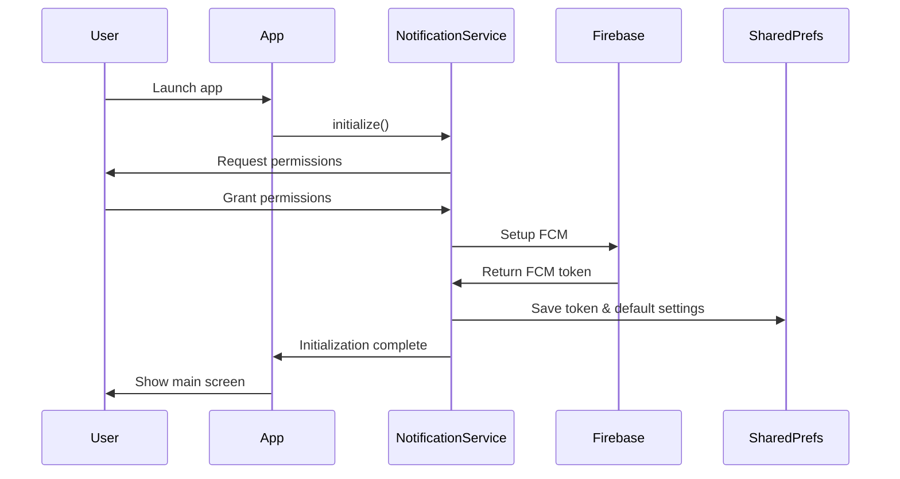
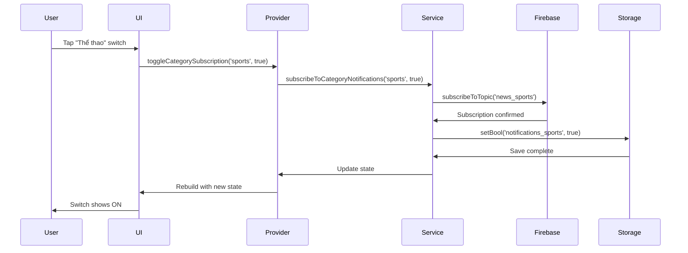
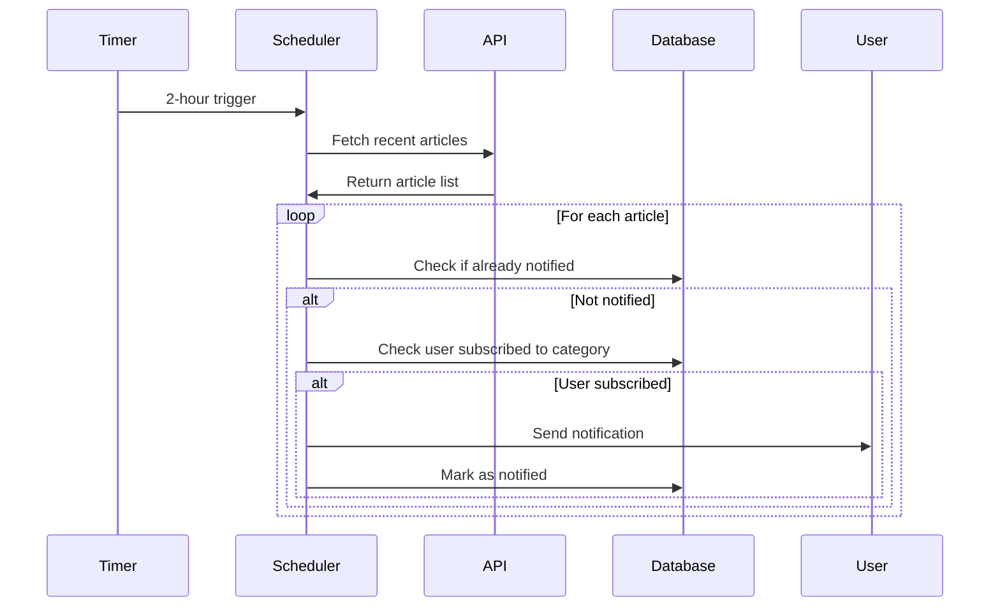
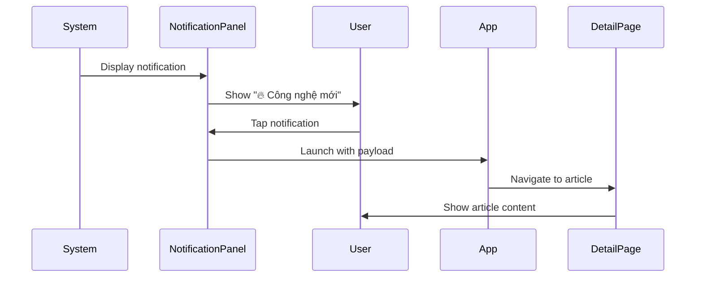

# 📱 Safe News - Notification System Documentation

## 📋 Mục lục
1. [Tổng quan chức năng](#tong-quan-chuc-nang)
2. [Kiến trúc hệ thống](#kien-truc-he-thong)
3. [Các thành phần chính](#cac-thanh-phan-chinh)
4. [Luồng hoạt động chi tiết](#luong-hoat-dong-chi-tiet)
5. [API Reference](#api-reference)
6. [Cấu hình và Setup](#cau-hinh-va-setup)
7. [Testing và Debugging](#testing-va-debugging)
8. [Best Practices](#best-practices)

---

## 🎯 Tổng quan chức năng {#tong-quan-chuc-nang}

### **Mô tả nghiệp vụ**
Hệ thống thông báo của Safe News cho phép người dùng:
- 🔔 **Nhận thông báo tự động** khi có tin tức mới
- 📂 **Tùy chỉnh theo danh mục** (7 categories: tin nóng, thể thao, công nghệ, kinh doanh, giải trí, sức khỏe, khoa học)
- ⚙️ **Điều khiển linh hoạt** bật/tắt theo ý muốn
- 🧪 **Test thông báo** để kiểm tra hoạt động
- 🔄 **Kiểm tra thủ công** tin mới bất cứ lúc nào

### **Giá trị mang lại**
- **Cho User**: Cập nhật tin tức kịp thời, không bỏ lỡ tin quan trọng
- **Cho App**: Tăng engagement, retention, user experience
- **Cho Business**: Tăng DAU, session time, brand awareness

---

## 🏗️ Kiến trúc hệ thống {#kien-truc-he-thong}

### **High-Level Architecture**
```
┌─────────────────┐    ┌──────────────────┐    ┌─────────────────┐
│   User Interface│    │  State Management│    │  Core Services  │
│                 │    │                  │    │                 │
│ • Settings UI   │◄──►│ • Riverpod       │◄──►│ • NotificationS │
│ • Test Button   │    │ • Provider       │    │ • NewsScheduler │
│ • Category List │    │ • State Sync     │    │ • Firebase FCM  │
└─────────────────┘    └──────────────────┘    └─────────────────┘
         ▲                       ▲                       ▲
         │                       │                       │
         ▼                       ▼                       ▼
┌─────────────────┐    ┌──────────────────┐    ┌─────────────────┐
│ Local Storage   │    │   API Layer      │    │ External Services│
│                 │    │                  │    │                 │
│ • SharedPrefs   │    │ • Article Repo   │    │ • Firebase      │
│ • Notification  │    │ • RSS Parser     │    │ • FCM Topics    │
│ • User Settings │    │ • Content Filter │    │ • Push Gateway  │
└─────────────────┘    └──────────────────┘    └─────────────────┘
```

### **Data Flow Architecture**
```
User Action → State Provider → Service Layer → External APIs
     ▲                                ▼
     └────── UI Update ◄─── State Change ◄──── Response
```

---

## 🔧 Các thành phần chính {#cac-thanh-phan-chinh}

### **1. NotificationService.dart** - "Engine chính"

#### **Vai trò và nhiệm vụ:**
- 🏭 **Factory Pattern**: Singleton instance cho toàn app
- 🔑 **Permission Management**: Xin quyền notification
- 📱 **Local Notifications**: Hiển thị thông báo trên device
- ☁️ **Firebase Integration**: FCM topics và messaging
- ⚙️ **Settings Management**: Lưu/load user preferences

#### **Key Methods:**
```dart
class NotificationService {
  // Singleton instance
  static final NotificationService _instance = NotificationService._internal();
  factory NotificationService() => _instance;

  // Initialization
  Future<void> initialize() async;

  // Notification display
  Future<void> showNotification({String title, String body, String? payload});

  // Topic management
  Future<void> subscribeToTopic(String topic);
  Future<void> unsubscribeFromTopic(String topic);

  // Settings
  Future<bool> areNotificationsEnabled();
  Future<void> setNotificationsEnabled(bool enabled);
  Future<bool> isSubscribedToCategory(String category);
}
```

#### **Cấu hình thông báo:**
```dart
const androidDetails = AndroidNotificationDetails(
  'safe_news_channel',              // Channel ID
  'Safe News',                      // App name hiển thị
  channelDescription: 'Thông báo tin tức từ Safe News',
  importance: Importance.high,       // Mức độ quan trọng cao
  priority: Priority.high,           // Ưu tiên cao
  icon: '@mipmap/ic_launcher',      // Icon app
  enableVibration: true,            // Rung
  enableLights: true,               // LED
  playSound: true,                  // Âm thanh
  showWhen: true,                   // Hiện thời gian
);
```

### **2. NewsNotificationScheduler.dart** - "Bộ giám sát"

#### **Vai trò và nhiệm vụ:**
- ⏰ **Periodic Monitoring**: Kiểm tra tin mới mỗi 2 giờ
- 🔍 **Content Analysis**: Phân tích và lọc tin tức
- 🚫 **Duplicate Prevention**: Tránh gửi thông báo trùng lặp
- 📊 **Smart Filtering**: Chỉ gửi tin theo category đã subscribe
- 💾 **History Tracking**: Lưu lịch sử thông báo đã gửi

#### **Core Logic:**
```dart
class NewsNotificationScheduler {
  Timer? _timer;
  static const Duration _checkInterval = Duration(hours: 2);

  // Bắt đầu monitoring
  void startPeriodicCheck({Duration interval = _checkInterval}) {
    _timer = Timer.periodic(interval, (_) => _checkForNewArticles());
  }

  // Logic kiểm tra tin mới
  Future<void> _checkForNewArticles() async {
    final newArticles = await _getRecentArticles();
    
    for (final article in newArticles) {
      if (await _shouldNotifyForArticle(article)) {
        await _sendNotificationForArticle(article);
      }
    }
  }
}
```

#### **Article Processing Pipeline:**
```
Raw Articles → Time Filter → Category Check → Duplicate Check → User Preference → Send Notification
```

### **3. NoticeSettingsProvider.dart** - "Control Panel"

#### **Vai trò và nhiệm vụ:**
- 🎛️ **State Management**: Quản lý trạng thái settings UI
- 💾 **Data Persistence**: Sync với SharedPreferences
- 🔄 **Real-time Updates**: UI tự động cập nhật khi state thay đổi
- 🧪 **Testing Interface**: Cung cấp test functionality
- ⚡ **Reactive Programming**: Sử dụng Riverpod patterns

#### **State Structure:**
```dart
class NotificationSettings {
  final bool isEnabled;                          // Bật/tắt tổng thể
  final Map<String, bool> categorySubscriptions; // Subscribe theo category
  final bool isLoading;                          // Loading state

  // Immutable state với copyWith pattern
  NotificationSettings copyWith({...});
}
```

#### **Provider Setup:**
```dart
final notificationSettingsProvider = StateNotifierProvider<
    NotificationSettingsNotifier, 
    NotificationSettings
>((ref) => NotificationSettingsNotifier());

// Usage trong UI
final settings = ref.watch(notificationSettingsProvider);
final notifier = ref.read(notificationSettingsProvider.notifier);
```

---

## 🔄 Luồng hoạt động chi tiết {#luong-hoat-dong-chi-tiet}

### **Scenario 1: Khởi tạo app lần đầu**



**Chi tiết technical:**
1. **App Startup**: main.dart khởi chạy
2. **Service Init**: `NotificationService().initialize()`
3. **Permission Request**: 
   ```dart
   await Permission.notification.request();
   await _firebaseMessaging.requestPermission();
   ```
4. **FCM Setup**:
   ```dart
   final token = await _firebaseMessaging.getToken();
   FirebaseMessaging.onMessage.listen(_handleForegroundMessage);
   ```
5. **Default Settings**: Tạo default preferences nếu chưa có

### **Scenario 2: User thay đổi notification settings**



**Chi tiết implementation:**
```dart
// 1. User interaction
onTap: () => notifier.toggleCategorySubscription('sports', true)

// 2. Provider method
Future<void> toggleCategorySubscription(String category, bool subscribe) async {
  state = state.copyWith(isLoading: true);
  
  try {
    // 3. Service call
    await _notificationService.subscribeToCategoryNotifications(category, subscribe);
    
    // 4. Update local state
    final updatedSubscriptions = Map<String, bool>.from(state.categorySubscriptions);
    updatedSubscriptions[category] = subscribe;
    
    state = state.copyWith(
      categorySubscriptions: updatedSubscriptions,
      isLoading: false,
    );
  } catch (e) {
    state = state.copyWith(isLoading: false);
    // Handle error
  }
}

// 5. Service implementation
Future<void> subscribeToCategoryNotifications(String category, bool subscribe) async {
  final topic = 'news_$category';
  
  if (subscribe) {
    await _firebaseMessaging.subscribeToTopic(topic);
  } else {
    await _firebaseMessaging.unsubscribeFromTopic(topic);
  }
  
  // Save to local storage
  final prefs = await SharedPreferences.getInstance();
  await prefs.setBool('notifications_$category', subscribe);
}
```

### **Scenario 3: Hệ thống phát hiện tin mới**



**Chi tiết processing pipeline:**

#### **A. Article Fetching:**
```dart
Future<List<ArticleModel>> _getRecentArticles() async {
  final articlesStream = _articleRepository.fetchArticle();
  final articles = await articlesStream.first;
  
  // Filter articles from last 2 hours
  final cutoffTime = DateTime.now().subtract(Duration(hours: 2));
  return articles.where((article) {
    return article.published.isAfter(cutoffTime);
  }).toList();
}
```

#### **B. Notification Decision Logic:**
```dart
Future<bool> _shouldNotifyForArticle(ArticleModel article) async {
  // 1. Check if already notified
  final articleId = article.link?.hashCode.toString() ?? '';
  final prefs = await SharedPreferences.getInstance();
  final notifiedArticles = prefs.getStringList('notified_articles') ?? [];
  
  if (notifiedArticles.contains(articleId)) {
    return false; // Already notified
  }
  
  // 2. Check if user subscribed to this category
  final category = _detectArticleCategory(article);
  final isSubscribed = await _notificationService.isSubscribedToCategory(category);
  
  return isSubscribed;
}
```

#### **C. Category Detection:**
```dart
String _detectArticleCategory(ArticleModel article) {
  final content = '${article.title} ${article.description}'.toLowerCase();
  
  if (content.contains('thể thao') || content.contains('bóng đá')) {
    return 'sports';
  } else if (content.contains('công nghệ') || content.contains('AI')) {
    return 'technology';
  } else if (content.contains('kinh tế') || content.contains('chứng khoán')) {
    return 'business';
  }
  // ... more categories
  
  return 'breaking_news'; // Default category
}
```

#### **D. Notification Delivery:**
```dart
Future<void> _sendNotificationForArticle(ArticleModel article) async {
  final category = _detectArticleCategory(article);
  final categoryName = _getCategoryDisplayName(category);
  
  await _notificationService.showNotification(
    title: '🔥 $categoryName mới',
    body: article.title,
    payload: jsonEncode({
      'type': 'news_article',
      'article_url': article.link,
      'category': category,
      'article_id': article.id,
    }),
  );
  
  // Mark as notified
  await _markAsNotified(article.link?.hashCode.toString() ?? '');
}
```

### **Scenario 4: User nhận và tương tác với thông báo**



**Chi tiết handling:**
```dart
// 1. Notification tap handler
void _onNotificationTapped(NotificationResponse response) {
  if (response.payload != null) {
    try {
      final data = jsonDecode(response.payload!);
      final articleUrl = data['article_url'];
      final category = data['category'];
      
      // Navigate to article detail
      _navigateToArticle(articleUrl, category);
    } catch (e) {
      // Handle malformed payload
    }
  }
}

// 2. Navigation implementation
void _navigateToArticle(String url, String category) {
  // Using GoRouter for navigation
  context.go('/article-detail', extra: {
    'url': url,
    'category': category,
    'source': 'notification',
  });
}
```

---

## 📚 API Reference {#api-reference}

### **NotificationService API**

#### **Core Methods:**
```dart
// Initialization
Future<void> initialize() async
  // Khởi tạo service, xin permissions, setup FCM

// Permission Management  
Future<bool> hasPermission() async
  // Kiểm tra quyền notification

Future<void> requestPermission() async
  // Xin quyền notification từ user

// Notification Display
Future<void> showNotification({
  required String title,
  required String body, 
  String? payload,
}) async
  // Hiển thị local notification

Future<void> showLocalNotification({
  required String title,
  required String body,
  String? payload,
}) async
  // Internal method for local notifications

// Topic Management
Future<void> subscribeToTopic(String topic) async
  // Subscribe FCM topic

Future<void> unsubscribeFromTopic(String topic) async
  // Unsubscribe FCM topic

Future<void> subscribeToCategoryNotifications(
  String category, 
  bool subscribe
) async
  // Subscribe/unsubscribe category-specific notifications

// Settings Management
Future<bool> areNotificationsEnabled() async
  // Kiểm tra notifications có được bật không

Future<void> setNotificationsEnabled(bool enabled) async
  // Bật/tắt notifications

Future<bool> isSubscribedToCategory(String category) async
  // Kiểm tra subscription status của category

// Utility
List<String> getNotificationCategories()
  // Lấy danh sách tất cả categories

Future<String?> getToken() async
  // Lấy FCM token

Future<void> sendTestNotification() async
  // Gửi test notification
```

### **NewsNotificationScheduler API**

```dart
// Lifecycle Management
void startPeriodicCheck({Duration interval = Duration(hours: 2)})
  // Bắt đầu monitoring tin mới

void stopPeriodicCheck()
  // Dừng monitoring

// Manual Operations  
Future<void> checkForNewNewsNow() async
  // Kiểm tra tin mới ngay lập tức

Future<void> clearNotificationHistory() async
  // Xóa lịch sử thông báo

// Internal Methods (for reference)
Future<List<ArticleModel>> _getRecentArticles() async
Future<bool> _shouldNotifyForArticle(ArticleModel article) async
Future<void> _sendNotificationForArticle(ArticleModel article) async
String _detectArticleCategory(ArticleModel article)
```

### **NotificationSettingsProvider API**

```dart
// State Access
NotificationSettings get state
  // Current state của settings

// State Mutations
Future<void> toggleNotifications(bool enabled) async
  // Bật/tắt notifications

Future<void> toggleCategorySubscription(
  String category, 
  bool subscribe
) async
  // Toggle subscription cho category

Future<void> sendTestNotification() async
  // Gửi test notification

// Internal
Future<void> _loadSettings() async
  // Load settings từ storage
```

### **Data Models**

#### **NotificationSettings:**
```dart
class NotificationSettings {
  final bool isEnabled;                          // Notifications enabled?
  final Map<String, bool> categorySubscriptions; // Category subscriptions  
  final bool isLoading;                          // Loading state

  const NotificationSettings({
    required this.isEnabled,
    required this.categorySubscriptions,
    this.isLoading = false,
  });

  NotificationSettings copyWith({
    bool? isEnabled,
    Map<String, bool>? categorySubscriptions, 
    bool? isLoading,
  });
}
```

#### **Notification Payload:**
```json
{
  "type": "news_article",
  "article_url": "https://example.com/article/123",
  "category": "technology", 
  "article_id": "article_123",
  "timestamp": "2025-07-03T10:30:00Z"
}
```

---

## ⚙️ Cấu hình và Setup {#cau-hinh-va-setup}

### **1. Firebase Configuration**

#### **FCM Setup:**
```dart
// firebase_options.dart (generated by Firebase CLI)
static const FirebaseOptions android = FirebaseOptions(
  apiKey: 'your-api-key',
  appId: 'your-app-id', 
  messagingSenderId: 'your-sender-id',
  projectId: 'your-project-id',
);
```

#### **Topics Configuration:**
```dart
// Predefined topics for categories
const NOTIFICATION_TOPICS = {
  'breaking_news': 'news_breaking_news',
  'sports': 'news_sports',
  'technology': 'news_technology', 
  'business': 'news_business',
  'entertainment': 'news_entertainment',
  'health': 'news_health',
  'science': 'news_science',
};
```

### **2. Android Configuration**

#### **android/app/build.gradle.kts:**
```kotlin
android {
    compileSdk 34
    
    defaultConfig {
        minSdk = 24  // Required for notifications
        targetSdk = 34
    }
    
    compileOptions {
        isCoreLibraryDesugaringEnabled = true // For notifications
        sourceCompatibility = JavaVersion.VERSION_11
        targetCompatibility = JavaVersion.VERSION_11
    }
}

dependencies {
    coreLibraryDesugaring("com.android.tools:desugar_jdk_libs:2.0.4")
}
```

#### **android/app/src/main/AndroidManifest.xml:**
```xml
<manifest xmlns:android="http://schemas.android.com/apk/res/android">
    <!-- Notification permissions -->
    <uses-permission android:name="android.permission.INTERNET" />
    <uses-permission android:name="android.permission.WAKE_LOCK" />
    <uses-permission android:name="android.permission.VIBRATE" />
    
    <application android:name="io.flutter.app.FlutterApplication">
        <!-- FCM default channel -->
        <meta-data
            android:name="com.google.firebase.messaging.default_notification_channel_id"
            android:value="safe_news_channel" />
            
        <!-- FCM service -->
        <service
            android:name="io.flutter.plugins.firebase.messaging.FlutterFirebaseMessagingService"
            android:exported="false">
            <intent-filter>
                <action android:name="com.google.firebase.MESSAGING_EVENT" />
            </intent-filter>
        </service>
    </application>
</manifest>
```

### **3. iOS Configuration**

#### **ios/Runner/Info.plist:**
```xml
<dict>
    <!-- Background modes for notifications -->
    <key>UIBackgroundModes</key>
    <array>
        <string>background-fetch</string>
        <string>remote-notification</string>
    </array>
    
    <!-- Notification permissions -->
    <key>NSUserNotificationAlertStyle</key>
    <string>alert</string>
</dict>
```

### **4. Dependency Configuration**

#### **pubspec.yaml:**
```yaml
dependencies:
  firebase_messaging: ^15.1.3
  flutter_local_notifications: ^18.0.1
  permission_handler: ^12.0.0+1
  shared_preferences: ^2.5.3
  flutter_riverpod: ^2.6.1
```

---

## 🧪 Testing và Debugging {#testing-va-debugging}

### **1. Testing Strategy**

#### **Unit Tests:**
```dart
// test/notification_service_test.dart
void main() {
  group('NotificationService Tests', () {
    test('should initialize without errors', () async {
      final service = NotificationService();
      expect(() => service.initialize(), returnsNormally);
    });
    
    test('should handle category subscriptions', () async {
      final service = NotificationService();
      await service.subscribeToCategoryNotifications('sports', true);
      
      final isSubscribed = await service.isSubscribedToCategory('sports');
      expect(isSubscribed, true);
    });
  });
}
```

#### **Widget Tests:**
```dart
// test/notification_settings_widget_test.dart
void main() {
  testWidgets('NotificationSettingsWidget should display categories', (tester) async {
    await tester.pumpWidget(
      ProviderScope(
        child: MaterialApp(
          home: NotificationSettingsWidget(),
        ),
      ),
    );
    
    expect(find.text('Thể thao'), findsOneWidget);
    expect(find.text('Công nghệ'), findsOneWidget);
    expect(find.byType(Switch), findsWidgets);
  });
}
```

#### **Integration Tests:**
```dart
// integration_test/notification_flow_test.dart
void main() {
  group('Notification Flow Tests', () {
    testWidgets('complete notification flow', (tester) async {
      // 1. Open app
      await tester.pumpWidget(MyApp());
      
      // 2. Navigate to settings
      await tester.tap(find.text('Profile'));
      await tester.tap(find.text('Cài đặt thông báo'));
      
      // 3. Toggle category
      await tester.tap(find.text('Công nghệ'));
      
      // 4. Send test notification
      await tester.tap(find.text('Test'));
      
      // Verify notification appears
      await tester.pump(Duration(seconds: 1));
    });
  });
}
```

### **2. Debug Tools**

#### **Logging Setup:**
```dart
// utils/logger.dart
class NotificationLogger {
  static void logInfo(String message) {
    if (kDebugMode) {
      print('[NOTIFICATION] INFO: $message');
    }
  }
  
  static void logError(String message, [dynamic error]) {
    if (kDebugMode) {
      print('[NOTIFICATION] ERROR: $message');
      if (error != null) print('[NOTIFICATION] DETAILS: $error');
    }
  }
}

// Usage trong service
NotificationLogger.logInfo('Initializing notification service');
NotificationLogger.logError('Failed to send notification', e);
```

#### **Debug UI:**
```dart
// features/debug/notification_debug_page.dart
class NotificationDebugPage extends StatelessWidget {
  @override
  Widget build(BuildContext context) {
    return Scaffold(
      appBar: AppBar(title: Text('Notification Debug')),
      body: Column(
        children: [
          ElevatedButton(
            onPressed: () => _testLocalNotification(),
            child: Text('Test Local Notification'),
          ),
          ElevatedButton(
            onPressed: () => _testFCMToken(),
            child: Text('Show FCM Token'),
          ),
          ElevatedButton(
            onPressed: () => _clearNotificationHistory(),
            child: Text('Clear History'),
          ),
        ],
      ),
    );
  }
}
```

### **3. Common Issues và Solutions**

#### **Issue 1: Notifications không hiển thị**
```dart
// Diagnosis checklist:
Future<void> diagnoseNotificationIssues() async {
  // 1. Check permissions
  final hasPermission = await Permission.notification.isGranted;
  print('Notification permission: $hasPermission');
  
  // 2. Check FCM token
  final token = await FirebaseMessaging.instance.getToken();
  print('FCM Token: $token');
  
  // 3. Check channel
  final channels = await _localNotifications
      .resolvePlatformSpecificImplementation<AndroidFlutterLocalNotificationsPlugin>()
      ?.getNotificationChannels();
  print('Notification channels: $channels');
  
  // 4. Test simple notification
  await _localNotifications.show(
    0, 'Test', 'Simple test notification', 
    NotificationDetails(android: AndroidNotificationDetails('test', 'Test')),
  );
}
```

#### **Issue 2: FCM subscription failures**
```dart
// Retry mechanism với exponential backoff
Future<void> subscribeWithRetry(String topic) async {
  int attempts = 0;
  const maxAttempts = 3;
  
  while (attempts < maxAttempts) {
    try {
      await FirebaseMessaging.instance.subscribeToTopic(topic);
      print('Successfully subscribed to $topic');
      return;
    } catch (e) {
      attempts++;
      final delay = Duration(seconds: pow(2, attempts).toInt());
      print('Subscription attempt $attempts failed, retrying in ${delay.inSeconds}s');
      await Future.delayed(delay);
    }
  }
  
  throw Exception('Failed to subscribe to $topic after $maxAttempts attempts');
}
```

---

## 💡 Best Practices {#best-practices}

### **1. Performance Optimization**

#### **Lazy Loading:**
```dart
// Chỉ initialize service khi cần
class NotificationService {
  static NotificationService? _instance;
  
  static NotificationService get instance {
    return _instance ??= NotificationService._internal();
  }
  
  bool _isInitialized = false;
  
  Future<void> ensureInitialized() async {
    if (!_isInitialized) {
      await initialize();
      _isInitialized = true;
    }
  }
}
```

#### **Batching Notifications:**
```dart
// Nhóm nhiều notifications thành 1
Future<void> sendBatchNotifications(List<ArticleModel> articles) async {
  if (articles.isEmpty) return;
  
  if (articles.length == 1) {
    await _sendSingleNotification(articles.first);
  } else {
    await _sendSummaryNotification(articles);
  }
}

Future<void> _sendSummaryNotification(List<ArticleModel> articles) async {
  final categoryCounts = <String, int>{};
  for (final article in articles) {
    final category = _detectArticleCategory(article);
    categoryCounts[category] = (categoryCounts[category] ?? 0) + 1;
  }
  
  final summary = categoryCounts.entries
      .map((e) => '${_getCategoryName(e.key)}: ${e.value} tin')
      .join(', ');
      
  await showNotification(
    title: '📰 ${articles.length} tin mới',
    body: summary,
  );
}
```

### **2. Error Handling Strategy**

#### **Graceful Degradation:**
```dart
Future<void> sendNotificationSafely({
  required String title,
  required String body,
}) async {
  try {
    await showNotification(title: title, body: body);
  } on PlatformException catch (e) {
    // Platform-specific error
    NotificationLogger.logError('Platform error: ${e.message}');
    await _fallbackToBasicNotification(title, body);
  } on FirebaseException catch (e) {
    // Firebase error
    NotificationLogger.logError('Firebase error: ${e.message}');
    await _showLocalNotificationOnly(title, body);
  } catch (e) {
    // Unknown error
    NotificationLogger.logError('Unknown error', e);
    // Fail silently - don't crash app
  }
}

Future<void> _fallbackToBasicNotification(String title, String body) async {
  // Use minimal configuration
  await _localNotifications.show(
    DateTime.now().millisecondsSinceEpoch.remainder(100000),
    title,
    body,
    NotificationDetails(
      android: AndroidNotificationDetails(
        'backup_channel',
        'Backup Notifications',
        importance: Importance.defaultImportance,
      ),
    ),
  );
}
```

### **3. Memory Management**

#### **Cleanup Resources:**
```dart
class NewsNotificationScheduler {
  Timer? _timer;
  
  void dispose() {
    _timer?.cancel();
    _timer = null;
  }
  
  void startPeriodicCheck() {
    dispose(); // Cleanup existing timer
    _timer = Timer.periodic(Duration(hours: 2), _checkForNews);
  }
}

// Trong app lifecycle
class _MyAppState extends State<MyApp> with WidgetsBindingObserver {
  @override
  void initState() {
    super.initState();
    WidgetsBinding.instance.addObserver(this);
  }
  
  @override
  void dispose() {
    NewsNotificationScheduler().dispose();
    WidgetsBinding.instance.removeObserver(this);
    super.dispose();
  }
  
  @override
  void didChangeAppLifecycleState(AppLifecycleState state) {
    if (state == AppLifecycleState.detached) {
      NewsNotificationScheduler().dispose();
    }
  }
}
```

### **4. User Experience Guidelines**

#### **Progressive Permissions:**
```dart
// Không xin permission ngay khi mở app
Future<void> requestPermissionWhenNeeded() async {
  // Chỉ xin khi user muốn enable notifications
  final userWantsNotifications = await showDialog<bool>(
    context: context,
    builder: (context) => AlertDialog(
      title: Text('Thông báo tin tức'),
      content: Text('Bạn có muốn nhận thông báo khi có tin mới?'),
      actions: [
        TextButton(onPressed: () => Navigator.pop(context, false), child: Text('Không')),
        TextButton(onPressed: () => Navigator.pop(context, true), child: Text('Có')),
      ],
    ),
  );
  
  if (userWantsNotifications == true) {
    await NotificationService().requestPermission();
  }
}
```

#### **Smart Timing:**
```dart
// Không gửi thông báo vào giờ nghỉ
bool _isAppropriateTimeForNotification() {
  final now = DateTime.now();
  final hour = now.hour;
  
  // Không gửi từ 22h - 7h
  if (hour >= 22 || hour < 7) {
    return false;
  }
  
  return true;
}

Future<void> sendNotificationIfAppropriate({
  required String title,
  required String body,
}) async {
  if (_isAppropriateTimeForNotification()) {
    await showNotification(title: title, body: body);
  } else {
    // Queue for later hoặc skip
    await _queueNotificationForLater(title, body);
  }
}
```

### **5. Testing Best Practices**

#### **Mock Services for Testing:**
```dart
// test/mocks/mock_notification_service.dart
class MockNotificationService extends Mock implements NotificationService {
  final List<NotificationCall> _calls = [];
  
  @override
  Future<void> showNotification({
    required String title,
    required String body,
    String? payload,
  }) async {
    _calls.add(NotificationCall(title, body, payload));
  }
  
  List<NotificationCall> get sentNotifications => List.unmodifiable(_calls);
  
  void clearHistory() => _calls.clear();
}

class NotificationCall {
  final String title;
  final String body;
  final String? payload;
  
  NotificationCall(this.title, this.body, this.payload);
}
```

#### **Test Utilities:**
```dart
// test/helpers/notification_test_helper.dart
class NotificationTestHelper {
  static Future<void> waitForNotification() async {
    await Future.delayed(Duration(milliseconds: 100));
  }
  
  static ProviderContainer createTestContainer() {
    return ProviderContainer(
      overrides: [
        notificationServiceProvider.overrideWithValue(MockNotificationService()),
      ],
    );
  }
  
  static Future<void> triggerBackgroundCheck() async {
    await NewsNotificationScheduler().checkForNewNewsNow();
  }
}
```

---

## 📋 Checklist triển khai

### **Development Checklist:**
- [ ] Firebase project setup với FCM enabled
- [ ] Android notification channel configuration  
- [ ] iOS push notification certificates
- [ ] Permission handling implementation
- [ ] Error handling và fallback mechanisms
- [ ] Testing với real devices
- [ ] Performance optimization
- [ ] Memory leak prevention

### **Production Checklist:**
- [ ] FCM production keys configured
- [ ] Notification analytics setup
- [ ] A/B testing cho notification content
- [ ] Rate limiting để tránh spam
- [ ] User feedback collection
- [ ] Monitoring và alerting
- [ ] Documentation updates
- [ ] Team training on maintenance

---

## 🔧 Advanced Configuration {#advanced-configuration}

### **1. Custom Notification Channels**

#### **Tạo multiple channels cho different priorities:**
```dart
// utils/notification_channels.dart
class NotificationChannels {
  static const String BREAKING_NEWS = 'breaking_news_channel';
  static const String REGULAR_NEWS = 'regular_news_channel';
  static const String SPORTS_UPDATES = 'sports_updates_channel';
  
  static final Map<String, AndroidNotificationChannel> channels = {
    BREAKING_NEWS: AndroidNotificationChannel(
      BREAKING_NEWS,
      'Tin nóng',
      description: 'Thông báo tin tức quan trọng',
      importance: Importance.max,
      sound: RawResourceAndroidNotificationSound('breaking_news_sound'),
      enableVibration: true,
      vibrationPattern: Int64List.fromList([0, 1000, 500, 1000]),
      enableLights: true,
    ),
    
    REGULAR_NEWS: AndroidNotificationChannel(
      REGULAR_NEWS,
      'Tin tức thường',
      description: 'Thông báo tin tức thường ngày',
      importance: Importance.high,
      enableVibration: true,
      enableLights: false,
    ),
    
    SPORTS_UPDATES: AndroidNotificationChannel(
      SPORTS_UPDATES,
      'Cập nhật thể thao',
      description: 'Tin tức thể thao và tỷ số',
      importance: Importance.high,
      sound: RawResourceAndroidNotificationSound('sports_sound'),
    ),
  };
  
  static Future<void> createAllChannels() async {
    final plugin = FlutterLocalNotificationsPlugin()
        .resolvePlatformSpecificImplementation<AndroidFlutterLocalNotificationsPlugin>();
    
    if (plugin != null) {
      for (final channel in channels.values) {
        await plugin.createNotificationChannel(channel);
      }
    }
  }
}
```

### **2. Rich Notifications với Actions**

#### **Notification với quick actions:**
```dart
Future<void> showRichNotification({
  required String title,
  required String body,
  required String articleUrl,
  String? imageUrl,
}) async {
  final androidDetails = AndroidNotificationDetails(
    'rich_news_channel',
    'Rich News Notifications',
    channelDescription: 'Notifications with actions and images',
    importance: Importance.high,
    priority: Priority.high,
    
    // Big picture style
    styleInformation: imageUrl != null 
        ? BigPictureStyleInformation(
            FilePathAndroidBitmap(await _downloadImage(imageUrl)),
            largeIcon: FilePathAndroidBitmap(await _getAppIcon()),
            contentTitle: title,
            summaryText: body,
          )
        : BigTextStyleInformation(
            body,
            contentTitle: title,
          ),
    
    // Action buttons
    actions: <AndroidNotificationAction>[
      AndroidNotificationAction(
        'read_now',
        'Đọc ngay',
        icon: DrawableResourceAndroidBitmap('@drawable/ic_read'),
        showsUserInterface: true,
      ),
      AndroidNotificationAction(
        'save_later',
        'Lưu sau',
        icon: DrawableResourceAndroidBitmap('@drawable/ic_bookmark'),
      ),
      AndroidNotificationAction(
        'share',
        'Chia sẻ',
        icon: DrawableResourceAndroidBitmap('@drawable/ic_share'),
      ),
    ],
  );

  await _localNotifications.show(
    DateTime.now().millisecondsSinceEpoch.remainder(100000),
    title,
    body,
    NotificationDetails(android: androidDetails),
    payload: jsonEncode({
      'type': 'rich_article',
      'url': articleUrl,
      'timestamp': DateTime.now().toIso8601String(),
    }),
  );
}

// Handle action responses
void _handleNotificationAction(NotificationResponse response) {
  final actionId = response.actionId;
  final payload = response.payload;
  
  switch (actionId) {
    case 'read_now':
      _openArticle(payload);
      break;
    case 'save_later':
      _saveArticleForLater(payload);
      break;
    case 'share':
      _shareArticle(payload);
      break;
  }
}
```

### **3. Smart Notification Scheduling**

#### **Intelligent timing based on user behavior:**
```dart
// utils/smart_scheduler.dart
class SmartNotificationScheduler {
  static const String _lastActiveTimeKey = 'last_active_time';
  static const String _preferredHoursKey = 'preferred_notification_hours';
  
  // Học habits của user
  Future<void> recordUserActivity() async {
    final prefs = await SharedPreferences.getInstance();
    final now = DateTime.now();
    
    await prefs.setString(_lastActiveTimeKey, now.toIso8601String());
    
    // Track preferred hours
    final currentHour = now.hour;
    final preferredHours = prefs.getStringList(_preferredHoursKey) ?? [];
    preferredHours.add(currentHour.toString());
    
    // Keep only last 50 records để tránh storage bloat
    if (preferredHours.length > 50) {
      preferredHours.removeRange(0, preferredHours.length - 50);
    }
    
    await prefs.setStringList(_preferredHoursKey, preferredHours);
  }
  
  // Determine optimal notification time
  Future<DateTime?> getOptimalNotificationTime() async {
    final prefs = await SharedPreferences.getInstance();
    final preferredHours = prefs.getStringList(_preferredHoursKey);
    
    if (preferredHours == null || preferredHours.isEmpty) {
      return null; // Send immediately
    }
    
    // Calculate most common active hours
    final hourCounts = <int, int>{};
    for (final hourStr in preferredHours) {
      final hour = int.tryParse(hourStr);
      if (hour != null) {
        hourCounts[hour] = (hourCounts[hour] ?? 0) + 1;
      }
    }
    
    // Find peak hour
    final peakHour = hourCounts.entries
        .reduce((a, b) => a.value > b.value ? a : b)
        .key;
    
    // Schedule for next occurrence of peak hour
    final now = DateTime.now();
    var targetTime = DateTime(now.year, now.month, now.day, peakHour);
    
    if (targetTime.isBefore(now)) {
      targetTime = targetTime.add(Duration(days: 1));
    }
    
    return targetTime;
  }
  
  // Schedule notification for optimal time
  Future<void> scheduleSmartNotification({
    required String title,
    required String body,
    String? payload,
  }) async {
    final optimalTime = await getOptimalNotificationTime();
    
    if (optimalTime == null || optimalTime.difference(DateTime.now()).inMinutes < 30) {
      // Send immediately
      await NotificationService().showNotification(
        title: title,
        body: body,
        payload: payload,
      );
    } else {
      // Schedule for later
      await _scheduleNotification(
        scheduledTime: optimalTime,
        title: title,
        body: body,
        payload: payload,
      );
    }
  }
}
```

---

## 📊 Monitoring và Analytics {#monitoring-analytics}

### **1. Notification Performance Tracking**

#### **Analytics implementation:**
```dart
// utils/notification_analytics.dart
class NotificationAnalytics {
  static const String _sentCountKey = 'notifications_sent_count';
  static const String _clickedCountKey = 'notifications_clicked_count';
  static const String _categoriesStatsKey = 'category_performance_stats';
  
  // Track notification sent
  static Future<void> trackNotificationSent({
    required String category,
    required String type, // 'local' or 'fcm'
  }) async {
    final prefs = await SharedPreferences.getInstance();
    
    // Overall stats
    final currentCount = prefs.getInt(_sentCountKey) ?? 0;
    await prefs.setInt(_sentCountKey, currentCount + 1);
    
    // Category stats
    await _updateCategoryStats(category, 'sent');
    
    // Log cho external analytics (Firebase Analytics, etc.)
    await FirebaseAnalytics.instance.logEvent(
      name: 'notification_sent',
      parameters: {
        'category': category,
        'type': type,
        'timestamp': DateTime.now().millisecondsSinceEpoch,
      },
    );
  }
  
  // Track notification clicked
  static Future<void> trackNotificationClicked({
    required String category,
    required String articleId,
  }) async {
    final prefs = await SharedPreferences.getInstance();
    
    final currentCount = prefs.getInt(_clickedCountKey) ?? 0;
    await prefs.setInt(_clickedCountKey, currentCount + 1);
    
    await _updateCategoryStats(category, 'clicked');
    
    await FirebaseAnalytics.instance.logEvent(
      name: 'notification_clicked',
      parameters: {
        'category': category,
        'article_id': articleId,
        'timestamp': DateTime.now().millisecondsSinceEpoch,
      },
    );
  }
  
  // Get performance metrics
  static Future<NotificationMetrics> getMetrics() async {
    final prefs = await SharedPreferences.getInstance();
    
    final sent = prefs.getInt(_sentCountKey) ?? 0;
    final clicked = prefs.getInt(_clickedCountKey) ?? 0;
    final clickRate = sent > 0 ? (clicked / sent * 100) : 0.0;
    
    final categoryStats = await _getCategoryStats();
    
    return NotificationMetrics(
      totalSent: sent,
      totalClicked: clicked,
      clickThroughRate: clickRate,
      categoryPerformance: categoryStats,
    );
  }
  
  static Future<void> _updateCategoryStats(String category, String action) async {
    final prefs = await SharedPreferences.getInstance();
    final statsJson = prefs.getString(_categoriesStatsKey) ?? '{}';
    final stats = Map<String, dynamic>.from(jsonDecode(statsJson));
    
    if (!stats.containsKey(category)) {
      stats[category] = {'sent': 0, 'clicked': 0};
    }
    
    stats[category][action] = (stats[category][action] ?? 0) + 1;
    
    await prefs.setString(_categoriesStatsKey, jsonEncode(stats));
  }
}

class NotificationMetrics {
  final int totalSent;
  final int totalClicked;
  final double clickThroughRate;
  final Map<String, CategoryPerformance> categoryPerformance;
  
  NotificationMetrics({
    required this.totalSent,
    required this.totalClicked,
    required this.clickThroughRate,
    required this.categoryPerformance,
  });
}

class CategoryPerformance {
  final int sent;
  final int clicked;
  final double clickRate;
  
  CategoryPerformance({
    required this.sent,
    required this.clicked,
    required this.clickRate,
  });
}
```

### **2. Performance Dashboard**

#### **Admin dashboard cho monitoring:**
```dart
// features/admin/notification_dashboard.dart
class NotificationDashboard extends ConsumerWidget {
  @override
  Widget build(BuildContext context, WidgetRef ref) {
    return Scaffold(
      appBar: AppBar(title: Text('📊 Notification Analytics')),
      body: FutureBuilder<NotificationMetrics>(
        future: NotificationAnalytics.getMetrics(),
        builder: (context, snapshot) {
          if (!snapshot.hasData) {
            return Center(child: CircularProgressIndicator());
          }
          
          final metrics = snapshot.data!;
          
          return SingleChildScrollView(
            padding: EdgeInsets.all(16),
            child: Column(
              crossAxisAlignment: CrossAxisAlignment.start,
              children: [
                _buildOverviewCards(metrics),
                SizedBox(height: 24),
                _buildCategoryPerformance(metrics),
                SizedBox(height: 24),
                _buildTrendChart(metrics),
              ],
            ),
          );
        },
      ),
    );
  }
  
  Widget _buildOverviewCards(NotificationMetrics metrics) {
    return Row(
      children: [
        Expanded(
          child: _MetricCard(
            title: 'Đã gửi',
            value: metrics.totalSent.toString(),
            icon: Icons.send,
            color: Colors.blue,
          ),
        ),
        SizedBox(width: 16),
        Expanded(
          child: _MetricCard(
            title: 'Đã click',
            value: metrics.totalClicked.toString(),
            icon: Icons.touch_app,
            color: Colors.green,
          ),
        ),
        SizedBox(width: 16),
        Expanded(
          child: _MetricCard(
            title: 'CTR',
            value: '${metrics.clickThroughRate.toStringAsFixed(1)}%',
            icon: Icons.analytics,
            color: Colors.orange,
          ),
        ),
      ],
    );
  }
}

class _MetricCard extends StatelessWidget {
  final String title;
  final String value;
  final IconData icon;
  final Color color;
  
  const _MetricCard({
    required this.title,
    required this.value,
    required this.icon,
    required this.color,
  });
  
  @override
  Widget build(BuildContext context) {
    return Card(
      child: Padding(
        padding: EdgeInsets.all(16),
        child: Column(
          children: [
            Icon(icon, color: color, size: 32),
            SizedBox(height: 8),
            Text(value, style: Theme.of(context).textTheme.headlineSmall),
            Text(title, style: Theme.of(context).textTheme.bodySmall),
          ],
        ),
      ),
    );
  }
}
```

---

## 🚨 Troubleshooting Guide {#troubleshooting-guide}

### **1. Common Issues và Solutions**

#### **🔴 Issue: Notifications không hiển thị**

**Triển khai systematic debugging:**
```dart
// utils/notification_diagnostics.dart
class NotificationDiagnostics {
  static Future<DiagnosticReport> runFullDiagnostic() async {
    final report = DiagnosticReport();
    
    // 1. Check app permissions
    report.hasNotificationPermission = await Permission.notification.isGranted;
    report.hasExactAlarmPermission = await Permission.scheduleExactAlarm.isGranted;
    
    // 2. Check device settings
    report.areNotificationsEnabledInSettings = await _checkDeviceNotificationSettings();
    
    // 3. Check Firebase setup
    try {
      final token = await FirebaseMessaging.instance.getToken();
      report.fcmToken = token;
      report.isFirebaseConfigured = token != null;
    } catch (e) {
      report.isFirebaseConfigured = false;
      report.firebaseError = e.toString();
    }
    
    // 4. Check notification channels
    report.availableChannels = await _getNotificationChannels();
    
    // 5. Test local notification
    try {
      await _testLocalNotification();
      report.localNotificationWorking = true;
    } catch (e) {
      report.localNotificationWorking = false;
      report.localNotificationError = e.toString();
    }
    
    // 6. Check background processing
    report.backgroundProcessingEnabled = await _checkBackgroundProcessing();
    
    return report;
  }
  
  static Future<void> _testLocalNotification() async {
    final plugin = FlutterLocalNotificationsPlugin();
    await plugin.show(
      999999,
      'Diagnostic Test',
      'If you see this, local notifications work',
      NotificationDetails(
        android: AndroidNotificationDetails(
          'diagnostic_channel',
          'Diagnostic',
          importance: Importance.high,
        ),
      ),
    );
  }
  
  static Future<List<String>> _getNotificationChannels() async {
    final androidPlugin = FlutterLocalNotificationsPlugin()
        .resolvePlatformSpecificImplementation<AndroidFlutterLocalNotificationsPlugin>();
    
    if (androidPlugin != null) {
      final channels = await androidPlugin.getNotificationChannels();
      return channels?.map((c) => c.id).toList() ?? [];
    }
    
    return [];
  }
}

class DiagnosticReport {
  bool? hasNotificationPermission;
  bool? hasExactAlarmPermission;
  bool? areNotificationsEnabledInSettings;
  bool? isFirebaseConfigured;
  String? fcmToken;
  String? firebaseError;
  List<String> availableChannels = [];
  bool? localNotificationWorking;
  String? localNotificationError;
  bool? backgroundProcessingEnabled;
  
  bool get isHealthy {
    return hasNotificationPermission == true &&
           areNotificationsEnabledInSettings == true &&
           isFirebaseConfigured == true &&
           localNotificationWorking == true;
  }
  
  List<String> get issues {
    final issues = <String>[];
    
    if (hasNotificationPermission != true) {
      issues.add('App không có quyền notification');
    }
    if (areNotificationsEnabledInSettings != true) {
      issues.add('Notifications bị tắt trong device settings');
    }
    if (isFirebaseConfigured != true) {
      issues.add('Firebase chưa được cấu hình đúng');
    }
    if (localNotificationWorking != true) {
      issues.add('Local notifications không hoạt động');
    }
    
    return issues;
  }
  
  List<String> get solutions {
    final solutions = <String>[];
    
    if (hasNotificationPermission != true) {
      solutions.add('Vào Settings > Apps > Safe News > Permissions > Notifications và bật');
    }
    if (areNotificationsEnabledInSettings != true) {
      solutions.add('Vào Settings > Notifications và kiểm tra cài đặt');
    }
    if (isFirebaseConfigured != true) {
      solutions.add('Kiểm tra google-services.json và Firebase configuration');
    }
    
    return solutions;
  }
}
```

#### **🔴 Issue: FCM topics không subscribe được**

**Solution với retry mechanism:**
```dart
Future<void> subscribeToCategoryWithRetry(String category, bool subscribe) async {
  const maxRetries = 3;
  const baseDelay = Duration(seconds: 1);
  
  for (int attempt = 0; attempt < maxRetries; attempt++) {
    try {
      final topic = 'news_$category';
      
      if (subscribe) {
        await FirebaseMessaging.instance.subscribeToTopic(topic);
      } else {
        await FirebaseMessaging.instance.unsubscribeFromTopic(topic);
      }
      
      // Verify subscription
      await Future.delayed(Duration(seconds: 2));
      final isSubscribed = await _verifyTopicSubscription(topic);
      
      if (isSubscribed == subscribe) {
        // Success
        NotificationLogger.logInfo('Successfully ${subscribe ? 'subscribed to' : 'unsubscribed from'} $topic');
        return;
      } else {
        throw Exception('Subscription verification failed');
      }
      
    } catch (e) {
      NotificationLogger.logError('Attempt ${attempt + 1} failed for $category: $e');
      
      if (attempt == maxRetries - 1) {
        // Final attempt failed
        throw Exception('Failed to ${subscribe ? 'subscribe to' : 'unsubscribe from'} $category after $maxRetries attempts');
      }
      
      // Wait before retry
      final delay = baseDelay * (attempt + 1);
      await Future.delayed(delay);
    }
  }
}

Future<bool> _verifyTopicSubscription(String topic) async {
  // Có thể verify bằng cách gửi test message
  // Hoặc check với Firebase console
  // Hiện tại return true vì FCM không có API verify trực tiếp
  return true;
}
```

#### **🔴 Issue: Background processing bị kill**

**Solution với persistent notification:**
```dart
// Giữ service alive với foreground service notification
Future<void> _ensureBackgroundProcessing() async {
  if (Platform.isAndroid) {
    // Create persistent notification để keep service alive
    await _showPersistentNotification();
    
    // Register for background processing
    await _registerBackgroundTasks();
  }
}

Future<void> _showPersistentNotification() async {
  const androidDetails = AndroidNotificationDetails(
    'background_service',
    'Background Service',
    channelDescription: 'Keeps notification service running',
    importance: Importance.low,
    priority: Priority.low,
    ongoing: true, // Cannot be dismissed
    autoCancel: false,
    enableVibration: false,
    playSound: false,
    icon: '@mipmap/ic_launcher',
  );

  await _localNotifications.show(
    -1, // Fixed ID for persistent notification
    'Safe News đang hoạt động',
    'Đang theo dõi tin tức mới cho bạn',
    NotificationDetails(android: androidDetails),
  );
}
```

### **2. Platform-Specific Issues**

#### **Android 13+ Permission Changes:**
```dart
Future<void> requestAndroid13Permissions() async {
  if (Platform.isAndroid) {
    final androidInfo = await DeviceInfoPlugin().androidInfo;
    
    if (androidInfo.version.sdkInt >= 33) {
      // Android 13+ requires explicit notification permission
      final status = await Permission.notification.request();
      
      if (status != PermissionStatus.granted) {
        // Show rationale và guide user to settings
        await _showPermissionRationale();
      }
    }
  }
}

Future<void> _showPermissionRationale() async {
  // Guide user to settings if permission denied
  showDialog(
    context: context,
    builder: (context) => AlertDialog(
      title: Text('Cần quyền thông báo'),
      content: Text(
        'Để nhận tin tức mới nhất, vui lòng cấp quyền thông báo '
        'trong Settings > Apps > Safe News > Permissions'
      ),
      actions: [
        TextButton(
          onPressed: () => Navigator.pop(context),
          child: Text('Để sau'),
        ),
        ElevatedButton(
          onPressed: () {
            Navigator.pop(context);
            openAppSettings();
          },
          child: Text('Mở Settings'),
        ),
      ],
    ),
  );
}
```

#### **iOS Silent Push Issues:**
```dart
// Configure for iOS silent push
Future<void> configureiOSBackgroundNotifications() async {
  if (Platform.isIOS) {
    await FirebaseMessaging.instance.setForegroundNotificationPresentationOptions(
      alert: true,
      badge: true,
      sound: true,
    );
    
    // Handle background messages
    FirebaseMessaging.onBackgroundMessage(_firebaseMessagingBackgroundHandler);
  }
}

// Top-level function for background handler
@pragma('vm:entry-point')
Future<void> _firebaseMessagingBackgroundHandler(RemoteMessage message) async {
  await Firebase.initializeApp();
  
  // Process background message
  NotificationLogger.logInfo('Background message: ${message.messageId}');
  
  // Show local notification if needed
  if (message.data['show_notification'] == 'true') {
    await NotificationService()._showLocalNotification(
      title: message.notification?.title ?? 'Safe News',
      body: message.notification?.body ?? 'Có tin tức mới',
    );
  }
}
```

---

## 📈 Performance Optimization {#performance-optimization}

### **1. Notification Batching Strategy**

#### **Smart batching để giảm noise:**
```dart
class NotificationBatcher {
  static const Duration _batchWindow = Duration(minutes: 15);
  static final Map<String, List<PendingNotification>> _pendingBatches = {};
  static Timer? _batchTimer;
  
  static Future<void> addToBatch(PendingNotification notification) async {
    final category = notification.category;
    
    if (!_pendingBatches.containsKey(category)) {
      _pendingBatches[category] = [];
    }
    
    _pendingBatches[category]!.add(notification);
    
    // Start batch timer if not already running
    _batchTimer ??= Timer(_batchWindow, _processBatches);
  }
  
  static Future<void> _processBatches() async {
    for (final entry in _pendingBatches.entries) {
      final category = entry.key;
      final notifications = entry.value;
      
      if (notifications.isEmpty) continue;
      
      if (notifications.length == 1) {
        // Send single notification
        await _sendSingleNotification(notifications.first);
      } else {
        // Send batched notification
        await _sendBatchedNotification(category, notifications);
      }
    }
    
    _pendingBatches.clear();
    _batchTimer = null;
  }
  
  static Future<void> _sendBatchedNotification(
    String category, 
    List<PendingNotification> notifications,
  ) async {
    final categoryName = _getCategoryDisplayName(category);
    final count = notifications.length;
    
    final title = '📰 $count tin $categoryName mới';
    final body = notifications.take(3)
        .map((n) => n.title)
        .join('\n');
    
    final moreCount = count - 3;
    final finalBody = moreCount > 0 
        ? '$body\n... và $moreCount tin khác'
        : body;
    
    await NotificationService().showNotification(
      title: title,
      body: finalBody,
      payload: jsonEncode({
        'type': 'batched_notifications',
        'category': category,
        'count': count,
        'articles': notifications.map((n) => n.toJson()).toList(),
      }),
    );
  }
}

class PendingNotification {
  final String title;
  final String body;
  final String category;
  final String? articleUrl;
  final DateTime createdAt;
  
  PendingNotification({
    required this.title,
    required this.body,
    required this.category,
    this.articleUrl,
    DateTime? createdAt,
  }) : createdAt = createdAt ?? DateTime.now();
  
  Map<String, dynamic> toJson() => {
    'title': title,
    'body': body,
    'category': category,
    'articleUrl': articleUrl,
    'createdAt': createdAt.toIso8601String(),
  };
}
```

### **2. Memory Management**

#### **Efficient history management:**
```dart
class NotificationHistoryManager {
  static const int _maxHistorySize = 1000;
  static const String _historyKey = 'notification_history';
  
  static Future<void> addToHistory(NotificationRecord record) async {
    final prefs = await SharedPreferences.getInstance();
    final historyJson = prefs.getString(_historyKey) ?? '[]';
    final history = List<Map<String, dynamic>>.from(jsonDecode(historyJson));
    
    // Add new record
    history.add(record.toJson());
    
    // Trim if necessary
    if (history.length > _maxHistorySize) {
      // Remove oldest records, keep only latest _maxHistorySize
      history.removeRange(0, history.length - _maxHistorySize);
    }
    
    await prefs.setString(_historyKey, jsonEncode(history));
  }
  
  static Future<List<NotificationRecord>> getHistory({
    String? category,
    int? limit,
  }) async {
    final prefs = await SharedPreferences.getInstance();
    final historyJson = prefs.getString(_historyKey) ?? '[]';
    final history = List<Map<String, dynamic>>.from(jsonDecode(historyJson));
    
    var records = history
        .map((json) => NotificationRecord.fromJson(json))
        .toList();
    
    // Filter by category if specified
    if (category != null) {
      records = records.where((r) => r.category == category).toList();
    }
    
    // Sort by timestamp (newest first)
    records.sort((a, b) => b.timestamp.compareTo(a.timestamp));
    
    // Apply limit
    if (limit != null && records.length > limit) {
      records = records.take(limit).toList();
    }
    
    return records;
  }
  
  static Future<void> clearHistory() async {
    final prefs = await SharedPreferences.getInstance();
    await prefs.remove(_historyKey);
  }
  
  // Cleanup old records periodically
  static Future<void> cleanupOldRecords() async {
    final cutoffDate = DateTime.now().subtract(Duration(days: 30));
    final allRecords = await getHistory();
    final recentRecords = allRecords
        .where((r) => r.timestamp.isAfter(cutoffDate))
        .toList();
    
    // Save only recent records
    final prefs = await SharedPreferences.getInstance();
    final json = jsonEncode(recentRecords.map((r) => r.toJson()).toList());
    await prefs.setString(_historyKey, json);
  }
}

class NotificationRecord {
  final String id;
  final String title;
  final String body;
  final String category;
  final DateTime timestamp;
  final bool wasClicked;
  final String? articleUrl;
  
  NotificationRecord({
    required this.id,
    required this.title,
    required this.body,
    required this.category,
    required this.timestamp,
    this.wasClicked = false,
    this.articleUrl,
  });
  
  Map<String, dynamic> toJson() => {
    'id': id,
    'title': title,
    'body': body,
    'category': category,
    'timestamp': timestamp.toIso8601String(),
    'wasClicked': wasClicked,
    'articleUrl': articleUrl,
  };
  
  factory NotificationRecord.fromJson(Map<String, dynamic> json) {
    return NotificationRecord(
      id: json['id'],
      title: json['title'],
      body: json['body'],
      category: json['category'],
      timestamp: DateTime.parse(json['timestamp']),
      wasClicked: json['wasClicked'] ?? false,
      articleUrl: json['articleUrl'],
    );
  }
}
```

---

## 🔐 Security Best Practices {#security-best-practices}

### **1. Secure Token Management**

```dart
// utils/secure_token_manager.dart
class SecureTokenManager {
  static const String _tokenKey = 'fcm_token_secure';
  static const String _tokenTimestampKey = 'fcm_token_timestamp';
  static const Duration _tokenRefreshInterval = Duration(days: 7);
  
  static Future<String?> getSecureToken() async {
    final prefs = await SharedPreferences.getInstance();
    final token = prefs.getString(_tokenKey);
    final timestampStr = prefs.getString(_tokenTimestampKey);
    
    if (token == null || timestampStr == null) {
      return await _refreshToken();
    }
    
    final timestamp = DateTime.parse(timestampStr);
    final shouldRefresh = DateTime.now().difference(timestamp) > _tokenRefreshInterval;
    
    if (shouldRefresh) {
      return await _refreshToken();
    }
    
    return token;
  }
  
  static Future<String?> _refreshToken() async {
    try {
      final token = await FirebaseMessaging.instance.getToken();
      
      if (token != null) {
        final prefs = await SharedPreferences.getInstance();
        await prefs.setString(_tokenKey, token);
        await prefs.setString(_tokenTimestampKey, DateTime.now().toIso8601String());
        
        // Send to backend for registration
        await _registerTokenWithBackend(token);
      }
      
      return token;
    } catch (e) {
      NotificationLogger.logError('Token refresh failed', e);
      return null;
    }
  }
  
  static Future<void> _registerTokenWithBackend(String token) async {
    // Register token with your backend server
    // Include user ID và device info for targeting
    try {
      final deviceInfo = await _getDeviceInfo();
      
      await ApiService.post('/register-token', {
        'token': token,
        'device_info': deviceInfo,
        'user_id': AuthService.currentUserId,
        'timestamp': DateTime.now().toIso8601String(),
      });
    } catch (e) {
      NotificationLogger.logError('Backend token registration failed', e);
    }
  }
}
```

### **2. Content Validation**

```dart
// utils/notification_validator.dart
class NotificationValidator {
  static const int _maxTitleLength = 50;
  static const int _maxBodyLength = 150;
  static const List<String> _allowedCategories = [
    'breaking_news', 'sports', 'technology', 'business',
    'entertainment', 'health', 'science',
  ];
  
  static ValidationResult validateNotification({
    required String title,
    required String body,
    required String category,
    String? articleUrl,
  }) {
    final errors = <String>[];
    
    // Title validation
    if (title.isEmpty) {
      errors.add('Title cannot be empty');
    } else if (title.length > _maxTitleLength) {
      errors.add('Title too long (max $_maxTitleLength chars)');
    } else if (_containsInappropriateContent(title)) {
      errors.add('Title contains inappropriate content');
    }
    
    // Body validation
    if (body.isEmpty) {
      errors.add('Body cannot be empty');
    } else if (body.length > _maxBodyLength) {
      errors.add('Body too long (max $_maxBodyLength chars)');
    } else if (_containsInappropriateContent(body)) {
      errors.add('Body contains inappropriate content');
    }
    
    // Category validation
    if (!_allowedCategories.contains(category)) {
      errors.add('Invalid category: $category');
    }
    
    // URL validation
    if (articleUrl != null && !_isValidUrl(articleUrl)) {
      errors.add('Invalid article URL');
    }
    
    return ValidationResult(
      isValid: errors.isEmpty,
      errors: errors,
    );
  }
  
  static bool _containsInappropriateContent(String content) {
    // Simple content filter - should be more sophisticated in production
    final inappropriateWords = ['spam', 'hack', 'virus', 'scam'];
    final lowerContent = content.toLowerCase();
    
    return inappropriateWords.any((word) => lowerContent.contains(word));
  }
  
  static bool _isValidUrl(String url) {
    try {
      final uri = Uri.parse(url);
      return uri.hasScheme && (uri.scheme == 'http' || uri.scheme == 'https');
    } catch (e) {
      return false;
    }
  }
  
  static String sanitizeText(String text) {
    // Remove potential XSS và harmful content
    return text
        .replaceAll(RegExp(r'<[^>]*>'), '') // Remove HTML tags
        .replaceAll(RegExp(r'[^\w\s\p{P}]', unicode: true), '') // Keep only word chars, whitespace, punctuation
        .trim();
  }
}

class ValidationResult {
  final bool isValid;
  final List<String> errors;
  
  ValidationResult({required this.isValid, required this.errors});
}
```

---

*📱 Hệ thống notification của Safe News được thiết kế để mang lại trải nghiệm tối ưu cho người dùng trong việc theo dõi tin tức, với performance cao, bảo mật tốt, và khả năng monitoring chi tiết!*

**📅 Document Version**: 2.0  
**👥 Author**: Safe News Development Team  
**📊 Last Updated**: January 16, 2025  
**🔧 Contains**: Advanced configurations, monitoring, troubleshooting, và security best practices**
